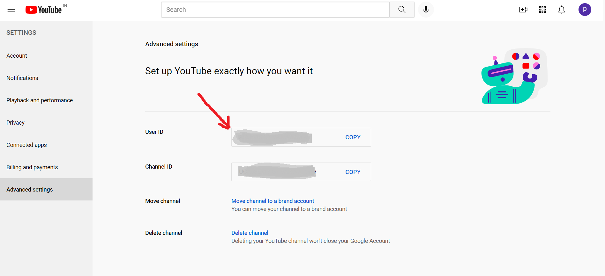

# YoutubeGeneratedPlaylist
A script that takes songs from selected Spotify playlist and generates a YouTube playlist (based on the songs saved in the Spotify playlist)
## Table of Contents 
* [Technologies](README.md#technologies)
* [Setup](README.md#localsetup)
## Technologies 
* [YouTube Data API v3](https://developers.google.com/youtube/v3)
* [Spotify Web API ](https://developer.spotify.com/documentation/web-api/)
* [Requests Library v 2.22.0](https://docs.python-requests.org/en/master/)
* [Youtube_dl v 2020.01.24](https://github.com/ytdl-org/youtube-dl/)
## LocalSetup
*  Install all dependencies 
  `pip install -r requirements.txt`
* Collect your Youtube User ID and Oauth Token and add it to secret.py file
* To Collect your User ID, Log intoYoutube then go here: [Account Advanced Settings](https://www.youtube.com/account_advanced) 
*  To Collect your Oauth Token, Visit this url here: [Get Oauth](https://developers.google.com/oauthplayground/) and follow the steps as given [here](https://stevesie.com/docs/pages/youtube-oauth-access-token)
* Good going! Now we have the Youtube Access Token. Add the User ID and Oauth Token to secret.py file
